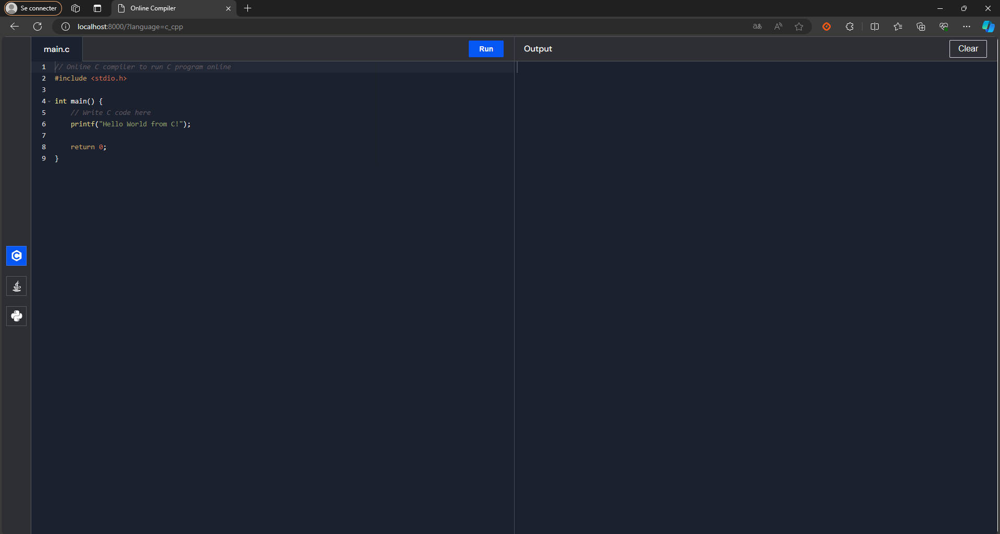
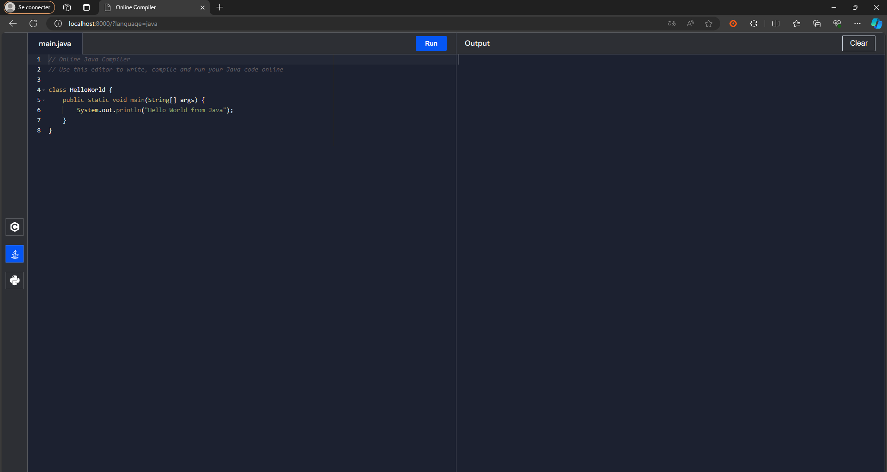
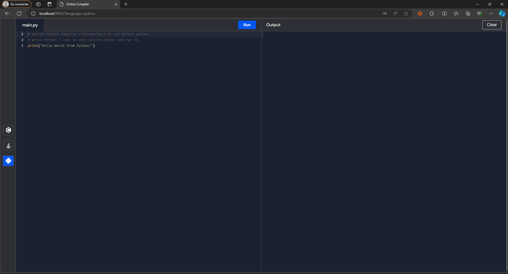

# 3131498-JeremyROBERT-BSCH-ET-FinalProject

Final Assignment of Emerging Technologies class at Griffith College. Create an online code compiler





# How to run

## Docker stack

Create a stack

```
$> docker swarm init
```

Start the project using docker stack command:

```
$> docker stack deploy --compose-file docker-stack.yml web-compiler
```

Check everything is running:

```
$> docker stack ls
$> docker stack ps web-compiler
```

> It should be available at: [http://localhost:8000](http://localhost:8000)

Stop the running stack

```
$> docker stack rm web-compiler
```
